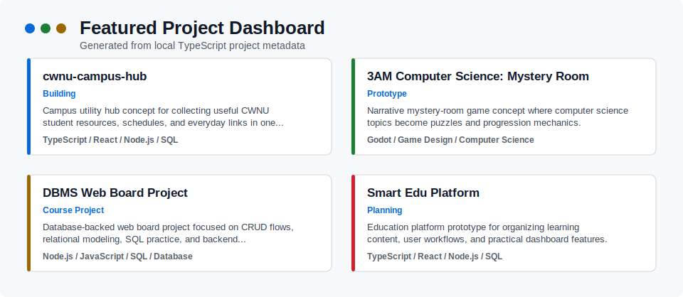

<!--
이 README는 npm run generate로 생성됩니다.
README.template.md와 src/projects.ts를 수정한 뒤 README.md를 다시 생성합니다.
-->

# 정이량 | GitHub Profile Developer Dashboard

**컴퓨터공학과 3학년 1학기 재학 중** 
AI · Big Data · Backend · Systems · Software Engineering에 관심을 두고 
실용적인 프로젝트를 만들며 GitHub 포트폴리오를 쌓고 있습니다.

GitHub: <code>jeongiryang</code> · 프로젝트 기반으로 배우고, 만들고, 기록합니다.

## 소개

- 컴퓨터공학 기본기를 바탕으로 실제로 동작하는 서비스를 만들고 기록하는 데 집중하고 있습니다.
- 수업 프로젝트, 개인 프로젝트, 자동화 도구를 GitHub 기반 워크플로우로 관리하며 개발자로서의 작업 방식을 다듬고 있습니다.
- 관심 분야는 `AI` `Big Data` `Backend` `Systems` `Software Engineering`입니다.

## 현재 작업 중인 프로젝트

### [cwnu-campus-hub](https://github.com/jeongiryang/cwnu-campus-hub)

창원대학교 학생들이 자주 쓰는 링크, 일정, 생활 편의 기능을 한곳에 모으는 캠퍼스 허브 프로젝트

- **기술 스택:** `TypeScript` `React` `Node.js` `GitHub Actions`
- **현재 집중 작업:** 주요 캠퍼스 링크 레지스트리 구축, 홈 대시보드 UI 개선, 즐겨찾기 기능 확장
- **상태:** 진행 중
- **저장소:** [https://github.com/jeongiryang/cwnu-campus-hub](https://github.com/jeongiryang/cwnu-campus-hub)

### [3AM Computer Science: Mystery Room](https://github.com/jeongiryang/3am-computer-science-mystery-room)

컴퓨터공학 개념을 퍼즐과 진행 요소로 녹여낸 Godot 기반 미스터리 룸 게임 프로젝트

- **기술 스택:** `Godot` `GDScript` `Game Design` `Documentation`
- **현재 집중 작업:** 게임 구조 설계, 룸 구성, 상호작용 시스템, 에셋 파이프라인 정리
- **상태:** 진행 중
- **저장소:** [https://github.com/jeongiryang/3am-computer-science-mystery-room](https://github.com/jeongiryang/3am-computer-science-mystery-room)

### [GitHub Profile Dashboard](https://github.com/jeongiryang/jeongiryang)

GitHub 프로필 README를 자동 생성하는 TypeScript 기반 포트폴리오 대시보드

- **기술 스택:** `TypeScript` `Node.js` `GitHub Actions` `Markdown` `SVG`
- **현재 집중 작업:** 선택 프로젝트 기반 섹션 구성, 한국어 UI 개선, SVG 카드 개선
- **상태:** 진행 중
- **저장소:** [https://github.com/jeongiryang/jeongiryang](https://github.com/jeongiryang/jeongiryang)

## 완료한 프로젝트

### [DBMS Web Board Project](https://github.com/jeongiryang/dbms-web-board-project)

Node.js와 SQL을 기반으로 구현한 DBMS 웹 게시판 프로젝트

- **기술 스택:** `Node.js` `Express` `SQL` `Authentication`
- **구현 결과:** 회원가입, 로그인, 게시글, 댓글, 좋아요, 페이징 등 핵심 게시판 기능 구현
- **상태:** 완료
- **저장소:** [https://github.com/jeongiryang/dbms-web-board-project](https://github.com/jeongiryang/dbms-web-board-project)

### [Smart Edu Platform](https://github.com/jeongiryang/smart-edu-platform)

개인화 학습 관리 앱을 주제로 진행한 소프트웨어공학 팀 프로젝트

- **기술 스택:** `React Native` `Expo` `Software Engineering` `Documentation`
- **구현 결과:** 요구사항 분석, 설계 문서, 구현 구조, 프로젝트 문서화 흐름 정리
- **상태:** 완료
- **저장소:** [https://github.com/jeongiryang/smart-edu-platform](https://github.com/jeongiryang/smart-edu-platform)

## 대표 프로젝트

### cwnu-campus-hub

| 항목 | 내용 |
|---|---|
| 분류 | 포트폴리오 |
| 상태 | 진행 중 |
| 핵심 설명 | 창원대학교 학생들이 자주 쓰는 링크, 일정, 생활 편의 기능을 한곳에 모으는 캠퍼스 허브 프로젝트 |
| 주요 기술 스택 | `TypeScript` `React` `Node.js` `GitHub Actions` |
| 현재 집중 작업 / 구현 결과 | 주요 캠퍼스 링크 레지스트리 구축, 홈 대시보드 UI 개선, 즐겨찾기 기능 확장 |
| 저장소 | [GitHub](https://github.com/jeongiryang/cwnu-campus-hub) |

### 3AM Computer Science: Mystery Room

| 항목 | 내용 |
|---|---|
| 분류 | 게임 |
| 상태 | 진행 중 |
| 핵심 설명 | 컴퓨터공학 개념을 퍼즐과 진행 요소로 녹여낸 Godot 기반 미스터리 룸 게임 프로젝트 |
| 주요 기술 스택 | `Godot` `GDScript` `Game Design` `Documentation` |
| 현재 집중 작업 / 구현 결과 | 게임 구조 설계, 룸 구성, 상호작용 시스템, 에셋 파이프라인 정리 |
| 저장소 | [GitHub](https://github.com/jeongiryang/3am-computer-science-mystery-room) |

### GitHub Profile Dashboard

| 항목 | 내용 |
|---|---|
| 분류 | 자동화 |
| 상태 | 진행 중 |
| 핵심 설명 | GitHub 프로필 README를 자동 생성하는 TypeScript 기반 포트폴리오 대시보드 |
| 주요 기술 스택 | `TypeScript` `Node.js` `GitHub Actions` `Markdown` `SVG` |
| 현재 집중 작업 / 구현 결과 | 선택 프로젝트 기반 섹션 구성, 한국어 UI 개선, SVG 카드 개선 |
| 저장소 | [GitHub](https://github.com/jeongiryang/jeongiryang) |

### DBMS Web Board Project

| 항목 | 내용 |
|---|---|
| 분류 | 수업 프로젝트 |
| 상태 | 완료 |
| 핵심 설명 | Node.js와 SQL을 기반으로 구현한 DBMS 웹 게시판 프로젝트 |
| 주요 기술 스택 | `Node.js` `Express` `SQL` `Authentication` |
| 현재 집중 작업 / 구현 결과 | 회원가입, 로그인, 게시글, 댓글, 좋아요, 페이징 등 핵심 게시판 기능 구현 |
| 저장소 | [GitHub](https://github.com/jeongiryang/dbms-web-board-project) |

### Smart Edu Platform

| 항목 | 내용 |
|---|---|
| 분류 | 팀 프로젝트 |
| 상태 | 완료 |
| 핵심 설명 | 개인화 학습 관리 앱을 주제로 진행한 소프트웨어공학 팀 프로젝트 |
| 주요 기술 스택 | `React Native` `Expo` `Software Engineering` `Documentation` |
| 현재 집중 작업 / 구현 결과 | 요구사항 분석, 설계 문서, 구현 구조, 프로젝트 문서화 흐름 정리 |
| 저장소 | [GitHub](https://github.com/jeongiryang/smart-edu-platform) |

## 기술 스택

| 구분 | 기술 |
|---|---|
| Languages | `C`, `Python`, `JavaScript`, `TypeScript`, `SQL` |
| Frameworks & Runtime | `Node.js`, `React`, `React Native`, `Expo`, `Godot` |
| Tools & Workflow | `Git`, `GitHub`, `GitHub Actions`, `Codex-assisted development`, `Markdown documentation` |

## 현재 학습 방향

- **AI / Big Data:** 데이터 기반 문제 해결과 인공지능 활용 역량 강화
- **Database:** SQL, 모델링, 정규화, 웹 서비스 연동 학습
- **Computer Networks:** HTTP, DNS, TCP/UDP 등 네트워크 핵심 개념 학습
- **Software Engineering:** 요구사항 분석, 설계, 구현, 검증, 문서화 흐름 정리
- **Computer Architecture:** 시스템 동작 원리와 하드웨어/소프트웨어 경계 이해
- **GitHub Workflow Automation:** Issue, PR, Actions 기반 자동화와 협업 흐름 개선
- **Practical project-based learning:** 작게 완성하고 반복 개선하는 프로젝트 중심 학습

## 개발 워크플로우

- 요구사항을 먼저 정리하고 구현 범위를 작게 나눕니다.
- 작업 단위별로 Issue와 브랜치를 만들고 변경 이유를 기록합니다.
- Codex를 활용해 구현, 리팩터링, 검증 과정을 빠르게 반복합니다.
- README, setup 문서, AI 작업 로그를 함께 관리합니다.
- 빌드와 생성 검증을 통과한 뒤 PR을 squash merge합니다.

## 자동 생성 대시보드

### 프로젝트 카드

### 최근 활동

GitHub API 데이터를 가져오지 못한 경우 fallback 활동 요약을 사용합니다.

- 프로필 대시보드 generator를 로컬 실행과 GitHub Actions 실행 모두 가능하도록 유지하고 있습니다.
- Backend, Database, Software Engineering 중심의 실용 프로젝트를 진행하고 있습니다.
- GitHub API를 사용할 수 없는 환경에서는 fallback 활동 데이터를 사용해 README를 생성합니다.

### 마지막 갱신

2026-05-17 21:22 KST
