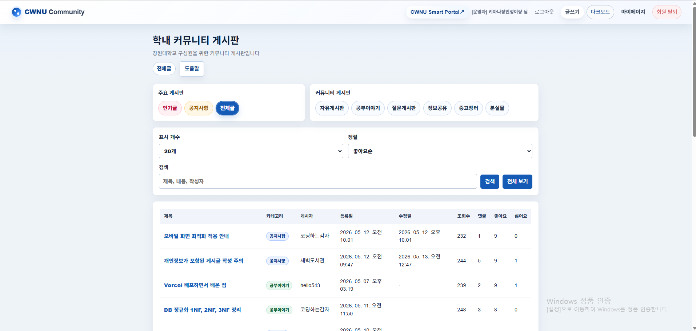
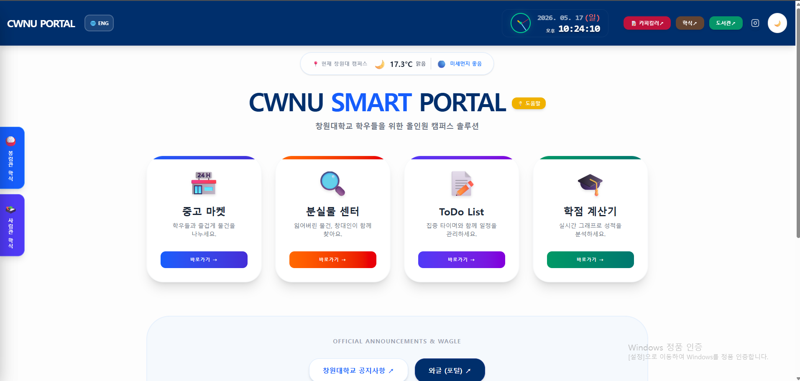

<!--
이 README는 npm run generate로 자동 생성됩니다.
README.template.md와 src/projects.ts를 수정한 뒤 README.md를 다시 생성합니다.
마지막 갱신: 2026-05-17 22:36 KST
-->

# 정이량

**컴퓨터공학과 3학년 1학기 재학 중**

Codex와 GitHub 기반 워크플로우로 
작게 만들고, 검증하고, 반복 개선하는 프로젝트를 진행하고 있습니다.

## About Me

> [!NOTE]
> AI를 단순 코드 생성 도구가 아니라 요구사항 정리, 구현, 검증, 문서화를 빠르게 반복하는 개발 파트너로 활용하는 방식을 연습하고 있습니다.

- 프로젝트를 작은 기능 단위로 나누어 구현합니다.
- GitHub Issue, branch, PR 흐름으로 작업을 관리합니다.
- README, setup 문서, AI 작업 로그로 과정을 기록합니다.

## 개발 완료 프로젝트

| 프로젝트 | 요약 | 결과 | 미리보기 |
|---|---|---|---|
| [DatabaseLanguage_NodeJS_CWNU-Community](https://github.com/jeongiryang/DatabaseLanguage_NodeJS_CWNU-Community) | Node.js와 PostgreSQL 기반 CWNU Community 게시판 | 회원가입, 로그인, 게시글, 댓글, 좋아요, 페이징 |  |
| [todo-app-mini-project-20222017](https://github.com/jeongiryang/todo-app-mini-project-20222017) | AI-assisted workflow로 제작한 Todo 리스트 미니 프로젝트 | Todo CRUD, 배포, 문서화 | - |

## 개발 중인 프로젝트

| 프로젝트 | 요약 | 진행 내용 | 미리보기 |
|---|---|---|---|
| [cwnu-campus-hub](https://github.com/jeongiryang/cwnu-campus-hub) | 창원대학교 생활 편의 기능을 모은 캠퍼스 허브 | 링크 레지스트리, 홈 대시보드, 즐겨찾기 |  |
| [3am-computer-science-mystery-room](https://github.com/jeongiryang/3am-computer-science-mystery-room) | Codex-assisted workflow로 제작 중인 Godot 기반 2D 인터랙티브 게임 | 룸 구성, 상호작용, 비주얼 개선 | - |
| SoftwareEngineering_team15_project_-Smart-Edu-Platform | 개인화 학습 관리 앱 팀 프로젝트 | 요구사항 분석, 설계, 구현 구조 정리 | - |
| [2026-barrier-free-tour-data-app](https://github.com/jeongiryang/2026-barrier-free-tour-data-app) | 사회적 약자를 위한 경상남도 맞춤형 관광 경로 안내 서비스 | 관광 데이터 활용, 경로 안내, 우회로 설계 | - |

## 수업 과제 아카이브

| 과제 | 요약 | 기술 |
|---|---|---|
| [DatabaseLanguage_SQL_Assignment](https://github.com/jeongiryang/DatabaseLanguage_SQL_Assignment) | MariaDB 환경에서 요구사항에 맞는 SQL 쿼리 작성 | SQL, MariaDB |
| [Algorithm_animal-animation_tool](https://github.com/jeongiryang/Algorithm_animal-animation_tool) | 애니멀 알고리즘 도구 사용 및 분석 | Python |
| [Network-Programming_TCP_and_UDP-Analysis](https://github.com/jeongiryang/Network-Programming_TCP_and_UDP-Analysis) | TCP와 UDP 프로토콜 차이 실험 및 분석 | C, Network |
| [OpenSource_1_team-project](https://github.com/jeongiryang/OpenSource_1_team-project) | Python 기반 간단한 텍스트 게임 구현 | Python |
| [Advanced_Data_Structures_Team6](https://github.com/jeongiryang/Advanced_Data_Structures_Team6) | 너구리 게임 코드 분석, 오류 수정, 완성 | C |
| [WebProgramming_team-project](https://github.com/jeongiryang/WebProgramming_team-project) | To-Do List와 중고나라 마켓 기능 구현 | JavaScript |
| [Computer-Graphics_project_Team1](https://github.com/jeongiryang/Computer-Graphics_project_Team1) | OpenGL을 사용해 3D 집 외부 구현 | C++, OpenGL |

**방문해주셔서 감사합니다.**

